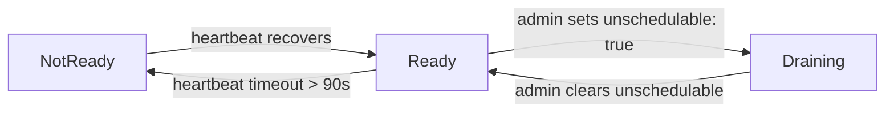

A **Node** is any physical or virtual machine running `cara-agent`. Nodes are the compute units of your cluster — every container workload ultimately runs on one. The control plane (`cara-server`) tracks nodes in its store and the scheduler selects from them when assigning projects.

## How nodes join the cluster

`cara-agent` self-registers with the control plane on startup. You do not need to pre-create a Node manifest; the agent posts its own record when it first contacts `cara-server`.

<Steps>
  <Step title="Start cara-agent">
    Set `SERVER_URL` to your control-plane address and `NODE_NAME` to the
    identifier you want to use in the cluster.

    ```bash
    SERVER_URL=http://cara-server:8080 \
    NODE_NAME=worker-01 \
      ./bin/cara-agent
    ```
  </Step>
  <Step title="Agent registers and begins heartbeating">
    On startup the agent writes a Node record to the control plane and immediately
    begins sending heartbeats every `HEARTBEAT_INTERVAL` (default `30s`).
    The control plane uses these heartbeats to compute the node's state.
  </Step>
  <Step title="Node becomes Ready">
    Once the first heartbeat is received and verified, the node transitions to
    `Ready` and becomes eligible for scheduling.
  </Step>
</Steps>

<Note>
  You can also register a node manually by applying a Node manifest with
  `caractrl apply -f node.yaml`. This is useful when you want to pre-assign
  labels before the agent starts.
</Note>

## Node states

The control plane computes a node's state from its heartbeat age and the
`unschedulable` flag. There are three possible states:

<CardGroup cols={3}>
  <Card title="Ready" icon="circle-check">
    The agent is healthy and posting heartbeats within the timeout window
    (90 seconds). The scheduler may assign new projects to this node.
  </Card>
  <Card title="NotReady" icon="circle-xmark">
    The agent's last heartbeat is older than 90 seconds. The scheduler will
    not assign new projects here. Running projects are subject to rescheduling
    after a grace period.
  </Card>
  <Card title="Draining" icon="circle-pause">
    An administrator has set `unschedulable: true`. The node is winding down
    gracefully. The health controller does not modify the state of a draining
    node — only an administrator can clear it.
  </Card>
</CardGroup>

### State transitions



<Info>
  The heartbeat timeout is fixed at 90 seconds. The agent sends a heartbeat
  every 30 seconds by default, so three consecutive missed beats trigger
  `NotReady`.
</Info>

## NodeSpec fields

`spec` contains the administrator-declared configuration of a node. You set
these fields in a manifest or patch them with `caractrl`.

| Field | Type | Description |
|-------|------|-------------|
| `hostname` | `string` | The OS-level hostname of the machine. Informational only. |
| `unschedulable` | `boolean` | When `true`, prevents new projects from being scheduled onto this node. Defaults to `false`. |

### Mark a node unschedulable

To prevent new projects from landing on a node — for example before
maintenance — set `unschedulable: true` in the node's manifest and re-apply
it:

```yaml
apiVersion: caravanserai/v1
kind: Node
metadata:
  name: worker-01
spec:
  hostname: worker-01.internal
  unschedulable: true
```

```bash
caractrl apply -f node.yaml
```

<Warning>
  Setting `unschedulable: true` does not evict projects that are already
  running on the node. It only gates new scheduling decisions. To drain
  running workloads, delete or reschedule them manually.
</Warning>

## NodeStatus fields

`status` is written by `cara-agent` (heartbeat fields) and the Controller
Manager (aggregated state). You read it — you do not write it directly.

<AccordionGroup>
  <Accordion title="state">
    The high-level health summary: `Ready`, `NotReady`, or `Draining`. Set
    by the control plane based on heartbeat age and the `unschedulable` flag.
  </Accordion>
  <Accordion title="network">
    Overlay-network connectivity reported by the agent. Contains:

    | Field | Description |
    |-------|-------------|
    | `ip` | Headscale-assigned overlay IP (e.g. `100.64.0.5`). |
    | `dnsName` | MagicDNS FQDN used for service discovery. |
    | `mode` | Connectivity mode — `Direct` or `DERP` (see below). |
    | `agentPort` | TCP port the agent's HTTP server listens on. Used by `caractrl` for port-forward tunnels. |
    | `throughput.download` | Last measured download speed (e.g. `"120Mbps"`). |
    | `throughput.upload` | Last measured upload speed. |
    | `throughput.lastTestTime` | Timestamp of the most recent speed measurement. |
  </Accordion>
  <Accordion title="capacity">
    Raw physical resource totals reported by the agent — `cpu`, `memory`, and
    `disk` — in Kubernetes-style quantity strings (e.g. `"4"`, `"16Gi"`,
    `"500Gi"`).
  </Accordion>
  <Accordion title="allocatable">
    `capacity` minus system-reserved amounts, also reported by the agent. The
    scheduler subtracts running-project usage from `allocatable` to derive
    effective available headroom.
  </Accordion>
  <Accordion title="lastHeartbeat">
    Timestamp of the most recent heartbeat received from the agent. The
    control plane compares this against the current time to detect timeouts.
  </Accordion>
  <Accordion title="conditions">
    A list of `Condition` objects describing observable aspects of the node's
    state. The `Ready` condition is the primary signal: `Status=True` means
    the agent is healthy; `Status=False` means the heartbeat timed out.
  </Accordion>
</AccordionGroup>

## Network modes

Caravanserai uses a Tailscale/Headscale overlay network to connect nodes
across networks. The `network.mode` field tells you which path the agent is
using to reach its peers.

<Tabs>
  <Tab title="Direct">
    A peer-to-peer path exists between the node and the control plane. This
    is the preferred mode — traffic travels directly between machines without
    a relay, giving the lowest latency.

    ```yaml
    status:
      network:
        mode: Direct
        ip: 100.64.0.5
        dnsName: worker-01.headscale.example.com
    ```
  </Tab>
  <Tab title="DERP">
    No direct peer-to-peer path is available. Traffic is relayed through a
    Designated Encrypted Relay for Packets (DERP) server. This happens when
    NAT traversal fails, such as in strict firewall environments.

    ```yaml
    status:
      network:
        mode: DERP
        ip: 100.64.0.5
        dnsName: worker-01.headscale.example.com
    ```

    <Tip>
      If a node stays in DERP mode, check that UDP port 41641 is open on the
      host firewall. Opening it allows direct connections and reduces relay
      latency.
    </Tip>
  </Tab>
</Tabs>

## Example Node manifest

The following manifest shows a fully annotated node registration. In practice
you only need `metadata.name`; all other fields are optional or computed.

```yaml
apiVersion: caravanserai/v1
kind: Node
metadata:
  name: pve1-server-03
  labels:
    caravanserai.io/zone: ed312
spec:
  hostname: pve-03
  unschedulable: false
```

Apply it with:

```bash
caractrl apply -f node.yaml
```

Inspect the node's live status (including network mode and heartbeat time)
with:

```bash
caractrl get nodes pve1-server-03
# or get the full record as JSON
caractrl --output json get nodes pve1-server-03
```
