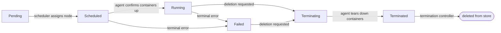

A **Project** is the primary workload resource in Caravanserai. It describes a
set of containers — called **services** — that must run together on a single
node. Services share a Docker bridge network and resolve each other by service
name, exactly as they do in Docker Compose.

## Mental model

<CardGroup cols={2}>
  <Card title="vs. Docker Compose" icon="docker">
    A Project maps directly to a `docker-compose.yml` file. Each `ServiceDef`
    is a Compose service; each `VolumeDef` is a named volume. The key
    difference is that Caravanserai schedules the entire project onto a cluster
    node rather than running it locally.
  </Card>
  <Card title="vs. Kubernetes" icon="dharmachakra">
    A Project is closest to a Kubernetes **Pod** (co-located containers, shared
    network) combined with a **Deployment** (desired-state reconciliation).
    Caravanserai does not scatter services across nodes — all services in a
    project always land on the same node.
  </Card>
</CardGroup>

## ProjectSpec fields

`spec` is the desired state you declare. The control plane and agent reconcile
the cluster toward it continuously.

### services

A list of `ServiceDef` objects — the containers that make up the project.
Every project must have at least one service.

| Field | Type | Description |
|-------|------|-------------|
| `name` | `string` | Unique name within the project. Used as the DNS hostname on the shared bridge network. |
| `image` | `string` | Docker image reference, e.g. `postgres:15`. |
| `env` | `EnvVar[]` | Environment variables to inject at container start. |
| `volumeMounts` | `VolumeMount[]` | Volumes to attach. Each entry specifies a `name` (matching a `VolumeDef`) and a `mountPath` inside the container. |

### volumes

A list of `VolumeDef` objects — named storage units that one or more services
can mount.

| Field | Type | Description |
|-------|------|-------------|
| `name` | `string` | Unique name within the project. Referenced by `volumeMounts[*].name`. |
| `type` | `string` | Volume lifecycle. Currently only `Ephemeral` is supported. |

<Note>
  An `Ephemeral` volume is created when the project starts and deleted when
  the project is stopped or moved. It does not survive rescheduling. If you
  need durable storage, manage the volume on the node directly and use a
  host path (not yet supported in the API; track the roadmap for `HostPath`
  support).
</Note>

### ingress

A list of `IngressDef` objects — HTTP routing rules that expose a service
through the cluster's ingress layer.

| Field | Type | Description |
|-------|------|-------------|
| `name` | `string` | Unique name for this ingress rule. |
| `host` | `string` | Hostname for the rule. If it contains a dot it is used verbatim; otherwise the final hostname is assembled as `{host}.{environment}.{baseDomain}`. |
| `target.service` | `string` | Name of the service to route traffic to. |
| `target.port` | `integer` | Port on the target service. |
| `access.scope` | `string` | Visibility scope. Currently only `Internal` is supported, routing traffic over the Headscale overlay network only. |

### expireAt

An optional RFC 3339 timestamp. When set, the garbage-collection controller
deletes the project automatically after this time. Use this for ephemeral
preview environments or time-boxed jobs.

```yaml
spec:
  expireAt: "2025-12-31T23:59:59Z"
```

## Project lifecycle

Every project moves through a defined set of phases. Phase transitions are
driven by two actors: the **scheduler** (part of `cara-server`) and the
**agent** running on the assigned node.



| Phase | Set by | Meaning |
|-------|--------|---------|
| `Pending` | API server | Project accepted; the scheduler has not yet assigned a node. |
| `Scheduled` | Scheduler | A target node has been chosen and written to `status.nodeRef`. The agent has not yet confirmed the containers are running. |
| `Running` | Agent | All containers are up and healthy. |
| `Failed` | Agent | The agent could not start the project or reported a terminal error. Check `status.conditions` for details. |
| `Terminating` | API server | Deletion has been requested. The agent is tearing down containers and Docker resources. |
| `Terminated` | Agent | All containers and Docker resources have been removed. The record is deleted from the store shortly after this phase is observed. |

## Conditions

`status.conditions` is a list of `Condition` objects that give you structured
detail about what happened at each phase transition. Two condition types are
relevant for projects:

<AccordionGroup>
  <Accordion title="Phase">
    Updated on every lifecycle phase transition. `status` is always `True`;
    the condition acts as a structured changelog rather than a health signal.
    Read `reason` (a CamelCase word) and `message` (human-readable) to
    understand why the project entered its current phase.

    ```yaml
    conditions:
      - type: Phase
        status: "True"
        reason: AgentReady
        message: "All containers are running"
        lastTransitionTime: "2025-06-01T12:00:05Z"
    ```
  </Accordion>
  <Accordion title="NotReadyAt">
    Written once when the control plane first observes a `Running` project on
    a `NotReady` node. `lastTransitionTime` marks the start of the grace
    period — after this window the control plane may intervene and reschedule
    the project.
  </Accordion>
  <Accordion title="TerminatingAt">
    Written once when the control plane first observes a `Terminating` project
    on a `NotReady` node. `lastTransitionTime` marks the start of the
    force-termination timeout clock.
  </Accordion>
</AccordionGroup>

<Tip>
  When a project enters `Failed`, the `Phase` condition's `reason` and
  `message` fields contain the best available explanation. Retrieve them with:

  ```bash
  caractrl --output json get projects my-project
  ```
</Tip>

## Example: multi-service project

The following manifest deploys a WordPress application with a MySQL database.
The `app` service references `db` by name — this works because both containers
share the project's Docker bridge network, just like Docker Compose.

<CodeGroup>

```yaml multi-service.yaml
apiVersion: caravanserai/v1
kind: Project
metadata:
  name: wordpress
spec:
  services:
    - name: db
      image: mysql:8
      env:
        - name: MYSQL_ROOT_PASSWORD
          value: "secret"
        - name: MYSQL_DATABASE
          value: "wp"
      volumeMounts:
        - name: mysql-data
          mountPath: /var/lib/mysql
    - name: app
      image: wordpress:latest
      env:
        - name: WORDPRESS_DB_HOST
          value: db          # resolves via the shared bridge network
        - name: WORDPRESS_DB_PASSWORD
          value: "secret"
        - name: WORDPRESS_DB_NAME
          value: "wp"
  volumes:
    - name: mysql-data
      type: Ephemeral
```

</CodeGroup>

Apply the project and watch it reach `Running`:

```bash
caractrl apply -f multi-service.yaml
# project/wordpress created

caractrl get projects wordpress
# NAME        PHASE     NODE       CONDITIONS        AGE
# wordpress   Running   worker-01  ContainersRunning  8s
```

Delete it when you are done (the agent tears down all containers and volumes):

```bash
caractrl delete project wordpress
```

## Docker resource naming

The agent uses deterministic names for every Docker resource it creates, so
reconciliation remains stateless across restarts.

| Resource | Pattern |
|----------|---------|
| Network | `cara-{projectName}` |
| Container | `{projectName}-{serviceName}` |
| Volume | `cara-{projectName}-{volumeName}` |

Every container also receives two labels:

```
cara.project = <projectName>
cara.service  = <serviceName>
```
