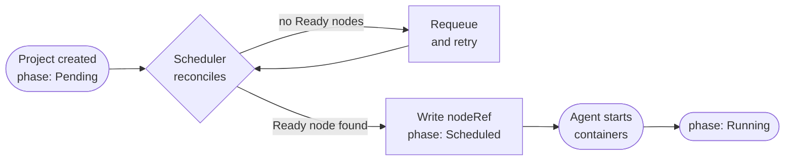

The **scheduler** is a controller inside `cara-server` that watches for
`Pending` projects and assigns each one to a suitable node. When a match is
found, the scheduler writes the node's name to `status.nodeRef` and advances
the project's phase to `Scheduled`. The agent on that node then picks up the
project and starts the containers.

## How the scheduler works



<Steps>
  <Step title="Project enters Pending">
    When you create a project with `caractrl apply`, the control plane accepts
    the manifest and sets `status.phase` to `Pending`.
  </Step>
  <Step title="Scheduler picks up the project">
    The scheduler watches for `Pending` projects continuously, processing each
    one promptly and re-checking all pending projects every 30 seconds as a
    fallback.
  </Step>
  <Step title="Scheduler selects a node">
    For each `Pending` project the scheduler finds nodes whose state is `Ready`
    and `unschedulable` is `false`, then picks one. It writes the node's name
    to `status.nodeRef` and advances the phase to `Scheduled`.

    If no Ready nodes are available, the scheduler retries automatically.
  </Step>
  <Step title="Agent confirms Running">
    The agent polls `cara-server` for projects assigned to its node. When it
    sees a `Scheduled` project it starts the containers. Once all containers
    are up, the agent patches `status.phase` to `Running`.
  </Step>
</Steps>

## Node eligibility criteria

The scheduler considers a node eligible if **all** of the following are true:

<CardGroup cols={3}>
  <Card title="state = Ready" icon="circle-check">
    The control plane has verified that the node's last heartbeat arrived
    within the past 90 seconds.
  </Card>
  <Card title="unschedulable = false" icon="lock-open">
    The node's `spec.unschedulable` field has not been set to `true` by an
    administrator.
  </Card>
  <Card title="Sufficient allocatable resources" icon="microchip">
    The node's `status.allocatable` (capacity minus system-reserved amounts)
    has enough headroom after accounting for already-running projects.
  </Card>
</CardGroup>

<Info>
  The current scheduling algorithm selects the first eligible node from the
  list of Ready nodes. A resource-aware, affinity-weighted algorithm
  is planned for a future release.
</Info>

## Phase progression

The table below shows which component is responsible for each phase
transition and what it means for your workload:

| Transition | Actor | What happens |
|------------|-------|-------------|
| Created → `Pending` | API server | Manifest is accepted and stored. |
| `Pending` → `Scheduled` | Scheduler | `status.nodeRef` is written; the agent will pick up the project on its next poll. |
| `Scheduled` → `Running` | Agent | All containers started successfully. |
| `Scheduled` / `Running` → `Failed` | Agent | The agent could not start or maintain the containers. See `status.conditions` for the error. |
| `Running` / `Failed` → `Terminating` | API server | Deletion request received; agent is tearing down. |
| `Terminating` → `Terminated` | Agent | All Docker resources removed. The record is deleted from the store shortly after. |

## Throughput metrics and scheduling

Each node's `status.network.throughput` field reports the last measured
download and upload speeds (e.g. `"120Mbps"`) and the time of the test. The
scheduler uses these values to estimate:

- **Download speed** — how long it will take the node to pull a container image or restore a backup before starting.
- **Upload speed** — RPO feasibility for workloads that write data back to object storage.

<Note>
  Throughput measurements are taken by the agent at startup and periodically
  thereafter. They are advisory inputs to the scheduling algorithm, not hard
  constraints. A node is never excluded from scheduling solely on the basis
  of measured throughput.
</Note>

## Influencing scheduling

<AccordionGroup>
  <Accordion title="Prevent scheduling onto a node">
    Set `spec.unschedulable: true` in the node's manifest and re-apply it.
    The scheduler will skip the node for all future assignments. Projects
    already running on the node are not affected.

    ```yaml
    apiVersion: caravanserai/v1
    kind: Node
    metadata:
      name: worker-01
    spec:
      unschedulable: true
    ```

    ```bash
    caractrl apply -f node.yaml
    ```
  </Accordion>
  <Accordion title="Use labels for workload placement (future)">
    Node labels (set under `metadata.labels`) are recorded in the store and
    will be used by affinity rules in a future scheduling algorithm. Applying
    labels now does not affect placement in the current release, but it is
    good practice to label nodes by zone, hardware tier, or other dimensions
    so you are ready when affinity support ships.

    ```yaml
    metadata:
      name: gpu-node-01
      labels:
        caravanserai.io/zone: us-west-1
        caravanserai.io/tier: gpu
    ```
  </Accordion>
</AccordionGroup>

## What to do if a project stays Pending

If your project stays in `Pending` for more than a few seconds, work through
the following checks:

<Steps>
  <Step title="Check node states">
    List all nodes and look at their state column.

    ```bash
    caractrl get nodes
    # NAME        STATE      AGE
    # worker-01   NotReady   2m
    ```

    If every node is `NotReady`, the scheduler has no eligible targets. Check
    that `cara-agent` is running on at least one node and that it can reach
    `cara-server`.
  </Step>
  <Step title="Check for unschedulable nodes">
    A node in `Ready` state with `spec.unschedulable: true` is still excluded.
    Inspect individual nodes:

    ```bash
    caractrl --output yaml get nodes worker-01
    ```

    Look for `spec.unschedulable: true`. If present, either clear the flag or
    bring another node online.
  </Step>
  <Step title="Check allocatable resources">
    If nodes are `Ready` but the project still does not schedule, the
    scheduler may have determined that no node has sufficient headroom. Check
    `status.allocatable` on each node and compare it against the resource
    requests in your project:

    ```bash
    caractrl --output json get nodes worker-01
    ```

    Reduce the project's resource requests or free capacity by removing other
    projects from the cluster.
  </Step>
  <Step title="Check the Phase condition">
    The project's `status.conditions` array includes a `Phase` condition
    with a `reason` and `message` on every transition attempt. Retrieve it
    to see the last error:

    ```bash
    caractrl --output json get projects my-project
    ```
  </Step>
</Steps>

## What happens when a project fails

If the agent cannot start the project or detects a terminal error after
start, it patches `status.phase` to `Failed` and writes a `Phase` condition
with the reason and a human-readable message.

<Warning>
  A `Failed` project does not reschedule automatically. You must either fix
  the underlying issue and re-create the project, or delete and re-apply the
  manifest.
</Warning>

If the node running a project becomes `NotReady`, the control plane writes a
`NotReadyAt` condition to mark the start of a grace period. After the grace
period expires, the control plane can force-terminate the project on the
failed node and return it to `Pending` so the scheduler can place it
elsewhere.
